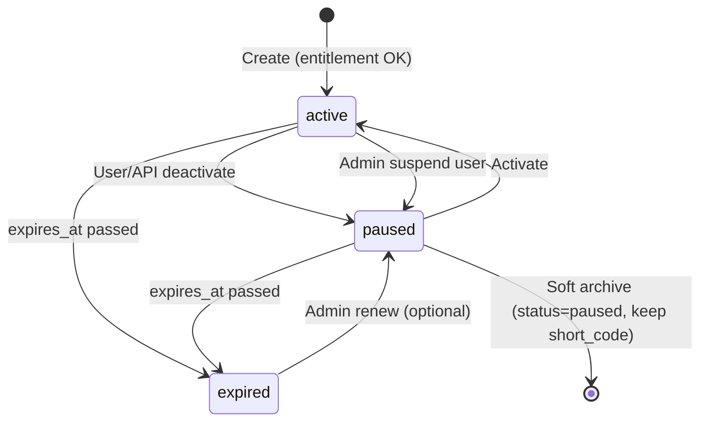
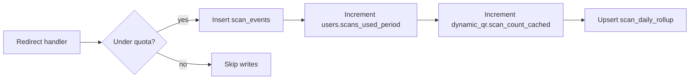
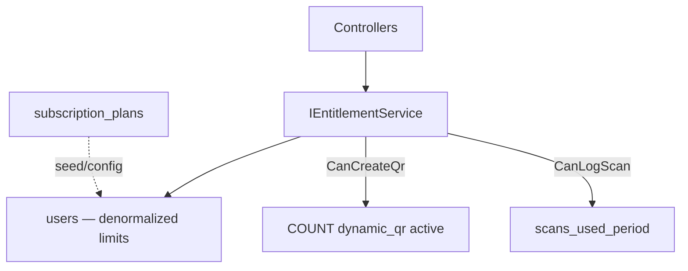

# Architecture: Dynamic QR Platform

Status: **design approved for planning — not implemented**  
Branch: `feature/dynamic-qr` until explicit production merge  
Related: [`architecture audit context`](./spec-dynamic-qr-v1-accounts-scale.md), [`integrated roadmap`](./plan-dynamic-qr-integrated-roadmap.md)

**Constraints**

- Keep existing stack: Next.js 14 + ASP.NET Core 8 + PostgreSQL 16 (Neon).
- Do **not** require QR image regeneration when `TargetUrl` changes.
- Static QR generator remains client-side and unchanged.
- MVP tables may exist (`dynamic_qr`, `scan_events`); this design **extends** them via new migrations only.

---

## 1. Architecture diagram

### 1.1 System context

```mermaid
flowchart TB
  subgraph clients [Clients]
    Browser[Web UI — Clerk session]
    Scanner[QR scanner — public]
    D365[D365FO / X++ / integrators]
  end

  subgraph vercel [Vercel — genmyqrcode.com]
    Next[Next.js SSR + generator]
    RW[Rewrites /r/* /api/*]
  end

  subgraph api [Railway — QrMarketing.Api]
    WebCtrl[Web API — session JWT]
    V1Ctrl[Public API — /api/v1/*]
    Redir[Redirect — GET /r/{shortCode}]
    Entitle[IEntitlementService]
    DynSvc[IDynamicQrService]
    ScanSvc[IScanLoggingService]
    Audit[IAuditLogService]
  end

  subgraph data [Neon PostgreSQL]
    Users[(users)]
    QR[(dynamic_qr)]
    Ext[(dynamic_qr_external_ref)]
    Events[(scan_events)]
    Rollup[(scan_daily_rollup)]
    Keys[(api_keys)]
    AuditT[(audit_logs)]
  end

  subgraph cache [Optional — scale tier]
    KV[(Edge KV / in-memory L1)]
  end

  Browser --> Next
  Next -->|Bearer JWT| RW --> WebCtrl
  D365 -->|API key| RW --> V1Ctrl
  Scanner --> RW --> Redir

  WebCtrl --> Entitle --> DynSvc
  V1Ctrl --> Entitle --> DynSvc
  Redir --> DynSvc
  Redir --> ScanSvc
  WebCtrl --> Audit
  V1Ctrl --> Audit

  DynSvc --> Users
  DynSvc --> QR
  DynSvc --> Ext
  ScanSvc --> Events
  ScanSvc --> Rollup
  ScanSvc --> Users
  Redir -.->|optional| KV
```

### 1.2 Conceptual flows

**Create (Web UI or API)**

```text
User (authenticated)
  → EntitlementService (QR count limit)
  → DynamicQrService.Create
      → allocate ShortCode (unique)
      → insert dynamic_qr (+ optional external_ref)
  → return { shortCode, shortUrl, id }
  → Frontend encodes shortUrl in qr-code-styling (image unchanged if TargetUrl updates later)
```

**Scan (public)**

```text
Client GET /r/{shortCode}
  → RedirectService.Resolve(shortCode)        [read-optimized]
  → if inactive/expired → 410
  → EntitlementService.TryRecordScan(userId)  [quota — soft degrade]
  → ScanLoggingService.Log (best-effort)      [write — must not block 302]
  → HTTP 302 Location: current TargetUrl
```

**Update (Dashboard or external API)**

```text
Owner JWT or API key
  → authorize resource (dynamic_qr.user_id)
  → PATCH TargetUrl / Status / metadata
  → audit log
  → invalidate optional destination cache
  → printed QR image still valid ( encodes /r/{shortCode} only )
```

---

## 2. Database ERD description

```text
users 1 ──< dynamic_qr * ──< scan_events *
  │              │
  │              └──1 dynamic_qr_external_ref 0..1  (or 1..* if multi-ref later)
  │
  ├──< api_keys *
  └── subscription fields (plan, quotas, counters)

scan_daily_rollup * ──> dynamic_qr (aggregate by qr_id + date)

audit_logs * ──> users (nullable actor) + resource type/id
```

**Ownership:** every `dynamic_qr` row has non-null `user_id` in production.  
**External systems:** optional row in `dynamic_qr_external_ref` keyed by `(system, external_type, external_id, company)` for idempotent upsert from D365.

---

## 3. Tables

Naming: snake_case in PostgreSQL; EF entities PascalCase.

### 3.1 `users`

| Column | Type | Notes |
|--------|------|--------|
| `id` | UUID PK | Internal id |
| `auth_provider_id` | VARCHAR(128) UNIQUE | Clerk `sub` |
| `email` | VARCHAR(320) | Nullable; from Clerk |
| `plan_code` | VARCHAR(32) NOT NULL DEFAULT `'free'` | FK logical to `subscription_plans.code` |
| `scan_quota_annual` | INT NOT NULL | Denormalized from plan; override for enterprise |
| `scans_used_period` | BIGINT NOT NULL DEFAULT 0 | Rolling counter |
| `quota_period_start` | TIMESTAMPTZ NOT NULL | Anniversary reset |
| `dynamic_qr_limit` | INT NOT NULL | Max active QRs |
| `api_enabled` | BOOLEAN NOT NULL DEFAULT false | Pro/enterprise |
| `status` | VARCHAR(20) NOT NULL DEFAULT `'active'` | active / suspended |
| `created_at` | TIMESTAMPTZ | |
| `updated_at` | TIMESTAMPTZ | |

### 3.2 `subscription_plans` (configurable — not hard-coded in app logic)

| Column | Type | Notes |
|--------|------|--------|
| `code` | VARCHAR(32) PK | free, pro, business, enterprise |
| `display_name` | VARCHAR(100) | |
| `scan_quota_annual` | INT | |
| `dynamic_qr_limit` | INT | |
| `api_enabled` | BOOLEAN | |
| `analytics_retention_days` | INT | 30 / 90 / 365 |
| `rate_limit_api_per_minute` | INT | |
| `is_active` | BOOLEAN | |

Seed rows in migration; change via DB/admin later — **not** scattered literals in controllers.

### 3.3 `dynamic_qr`

| Column | Type | Notes |
|--------|------|--------|
| `id` | UUID PK | Stable id for API `{id}` |
| `user_id` | UUID NOT NULL FK → users | Ownership |
| `short_code` | VARCHAR(10) NOT NULL UNIQUE | Public redirect key |
| `name` | VARCHAR(100) | Display name (maps spec “Name”) |
| `qr_type` | VARCHAR(32) NOT NULL DEFAULT `'url_redirect'` | MVP: only this type |
| `target_url` | VARCHAR(2048) NOT NULL | Current destination (http/https) |
| `status` | VARCHAR(20) NOT NULL DEFAULT `'active'` | active / paused / expired |
| `expires_at` | TIMESTAMPTZ NULL | Optional |
| `scan_count_cached` | BIGINT NOT NULL DEFAULT 0 | Denormalized total for fast reads |
| `created_at` | TIMESTAMPTZ | |
| `updated_at` | TIMESTAMPTZ | |

**Migration note:** map existing `destination_url` → `target_url`, `label` → `name`, `is_active` → `status`.

Legacy `owner_token_hash`: nullable after migration; deprecated for prod.

### 3.4 `dynamic_qr_external_ref`

| Column | Type | Notes |
|--------|------|--------|
| `id` | UUID PK | |
| `dynamic_qr_id` | UUID NOT NULL UNIQUE FK | One ref row per QR in MVP |
| `external_system` | VARCHAR(64) NOT NULL | e.g. `D365FO` |
| `external_company` | VARCHAR(64) NULL | e.g. `USMF` |
| `external_type` | VARCHAR(64) NOT NULL | e.g. `SalesOrder` |
| `external_id` | VARCHAR(128) NOT NULL | e.g. `SO-000123` |
| `metadata_json` | JSONB NULL | Optional extra keys |
| `created_at` | TIMESTAMPTZ | |

Unique constraint for idempotent create from ERP:

```sql
UNIQUE (external_system, external_company, external_type, external_id)
```

### 3.5 `scan_events` (append-only, high volume)

| Column | Type | Notes |
|--------|------|--------|
| `id` | BIGSERIAL PK | |
| `dynamic_qr_id` | UUID NOT NULL FK | |
| `scanned_at` | TIMESTAMPTZ NOT NULL DEFAULT now() | |
| `device_type` | VARCHAR(20) NULL | mobile / tablet / desktop |
| `browser` | VARCHAR(32) NULL | Parsed from UA |
| `os` | VARCHAR(32) NULL | Parsed from UA |
| `country` | CHAR(2) NULL | Edge header |
| `referrer` | VARCHAR(255) NULL | Truncated |
| `ip_hash` | CHAR(64) NULL | SHA-256(salt + IP); optional |

**No raw IP** stored by default (privacy + spec).

### 3.6 `scan_daily_rollup`

| Column | Type | Notes |
|--------|------|--------|
| `dynamic_qr_id` | UUID FK | |
| `scan_date` | DATE | UTC date |
| `scan_count` | INT NOT NULL | |
| PRIMARY KEY (`dynamic_qr_id`, `scan_date`) | | |

Updated by batch job or synchronous increment on scan (upsert) — see §7.

### 3.7 `api_keys`

| Column | Type | Notes |
|--------|------|--------|
| `id` | UUID PK | |
| `user_id` | UUID NOT NULL FK | |
| `key_prefix` | VARCHAR(12) NOT NULL | Display `byq_live_abc…` |
| `key_hash` | CHAR(64) NOT NULL | SHA-256 of secret |
| `name` | VARCHAR(100) NOT NULL | |
| `scopes` | TEXT NOT NULL | e.g. `qr:read,qr:write` |
| `last_used_at` | TIMESTAMPTZ NULL | |
| `revoked_at` | TIMESTAMPTZ NULL | |
| `created_at` | TIMESTAMPTZ | |

### 3.8 `audit_logs`

| Column | Type | Notes |
|--------|------|--------|
| `id` | BIGSERIAL PK | |
| `occurred_at` | TIMESTAMPTZ NOT NULL DEFAULT now() | |
| `actor_user_id` | UUID NULL FK | Null for system |
| `actor_type` | VARCHAR(20) NOT NULL | user / api_key / system |
| `actor_id` | VARCHAR(128) NULL | api_key id or sub |
| `action` | VARCHAR(64) NOT NULL | qr.created, qr.target_updated, … |
| `resource_type` | VARCHAR(32) NOT NULL | dynamic_qr |
| `resource_id` | UUID NOT NULL | |
| `ip_hash` | CHAR(64) NULL | |
| `metadata_json` | JSONB NULL | Old/new URL hashes, not secrets |

---

## 4. Important indexes

| Index | Table | Purpose |
|-------|-------|---------|
| `PK` / `UNIQUE (short_code)` | dynamic_qr | Redirect lookup — **hottest path** |
| `idx_dynamic_qr_user_id` | dynamic_qr | Dashboard list |
| `idx_dynamic_qr_user_status` | dynamic_qr | `(user_id, status)` partial active |
| `UNIQUE (external_system, external_company, external_type, external_id)` | dynamic_qr_external_ref | D365 idempotent create |
| `idx_scan_events_qr_time` | scan_events | `(dynamic_qr_id, scanned_at DESC)` analytics |
| `idx_scan_events_scanned_at` | scan_events | Retention purge / partition attach |
| `PK (dynamic_qr_id, scan_date)` | scan_daily_rollup | Trend queries |
| `idx_users_auth_provider_id` | users | JWT → user |
| `idx_api_keys_key_hash` | api_keys | M2M auth (only non-revoked) |
| `idx_audit_resource` | audit_logs | `(resource_type, resource_id, occurred_at DESC)` |

**Redirect read query (target):**

```sql
SELECT id, user_id, target_url, status, expires_at
FROM dynamic_qr
WHERE short_code = @code
LIMIT 1;
```

Single index seek on `short_code` — no join on hot path. Load `user_id` only if quota check needed (can cache quota headroom).

**Scale tier (later):** partition `scan_events` by month; keep 90-day hot partitions.

---

## 5. Dynamic QR lifecycle



| Status | `/r/{code}` behavior |
|--------|----------------------|
| `active` | 302 if quota allows logging |
| `paused` | **410 Gone** |
| `expired` | **410 Gone** |

**Delete:** MVP = **no hard delete**; pause only. Preserves scan history and printed codes semantics.

**TargetUrl change:** any status `active` — update in place; **short_code unchanged** → QR image unchanged.

---

## 6. ShortCode generation strategy

Reuse existing `ShortCodeGenerator`:

| Rule | Value |
|------|--------|
| Length | 8 chars default (config `DynamicQr:ShortCodeLength`) |
| Alphabet | Crockford-like — omit ambiguous `0/O/1/l/I` |
| Uniqueness | DB `UNIQUE (short_code)` + retry loop (max 8 attempts) |
| Entropy | ~32^8 combinations at 8 chars |

**Never** embed target URL or user id in short code.

**Collision under load:** rare; retry in transaction; fail 503 if exhausted.

---

## 7. Redirect architecture

### 7.1 Route

- Public: `GET /r/{shortCode}` on API (proxied via Vercel same-origin).
- Optional future: Cloudflare Worker at edge with KV cache — **not MVP**.

### 7.2 Handler pipeline (order matters)

```text
1. Rate limit by IP (token bucket)
2. Lookup dynamic_qr by short_code (indexed)
3. Validate status + expires_at → else 410
4. Resolve target_url (already validated on write)
5. Fire-and-forget OR background channel: scan log + counters
6. Return 302 Location (no body)
```

**Critical:** step 6 must **not** wait for step 5 to commit. Scan logging is **best-effort**.

### 7.3 Quota on scan (subscription integration)

- Check `users.scans_used_period` vs `scan_quota_annual` **before** logging.
- If over quota: **still 302** (soft degrade); skip event insert; header `X-QR-Quota-Exceeded: 1`.
- Increment counter only when event logged (or use separate “billable scan” counter).

---

## 8. Scan logging architecture



| Concern | Approach |
|---------|----------|
| Write amplification | 1 insert + 2–3 updates per scan — acceptable until ~100k scans/day |
| Hot path latency | Decouple: queue in memory channel (`BackgroundService`) or `Task.Run` with scoped DI — **302 first** |
| UA parsing | Reuse `DeviceTypeParser`; extend for browser/os |
| IP | Hash with server salt; optional null if header missing |
| Failure | Log error; redirect already sent |

**High volume tier:** async worker batch insert; rollup-only mode for free tier (skip per-event rows) — **future**, not MVP.

---

## 9. Analytics architecture

| Layer | Data | Use |
|-------|------|-----|
| Real-time total | `dynamic_qr.scan_count_cached` | Dashboard badge |
| Period total | `users.scans_used_period` | Quota bar |
| Trends | `scan_daily_rollup` | 7d / 30d charts (Phase 6+) |
| Detail | `scan_events` | Device/country breakdown; retention limited by plan |

**Queries (Phase 6+ UI):**

- Today / 7d / 30d: `SUM(scan_count)` from rollup.
- Device breakdown: `GROUP BY device_type` on `scan_events` with `scanned_at > now() - retention` — **indexed**.

**Retention job:** nightly delete `scan_events` older than `subscription_plans.analytics_retention_days` for user's plan; rollups retained.

---

## 10. API architecture

### 10.1 Two surfaces (same services, different auth)

| Surface | Base path | Auth | Consumer |
|---------|-----------|------|----------|
| **Web** | `/api/dynamic-qr/*` | Clerk JWT | Next.js UI |
| **Public v1** | `/api/v1/qr/*` | API key (Bearer) | D365, scripts, partners |

Both call `IDynamicQrService`, `IEntitlementService`, `IAuditLogService` — **no business logic in controllers**.

### 10.2 Public v1 endpoints (design)

| Method | Path | Purpose |
|--------|------|---------|
| POST | `/api/v1/qr` | Create (+ optional external ref) |
| GET | `/api/v1/qr/{id}` | Get by UUID |
| GET | `/api/v1/qr/by-code/{shortCode}` | Get by short code |
| GET | `/api/v1/qr` | List (paginated) |
| PUT | `/api/v1/qr/{id}` | Replace metadata (not short_code) |
| PATCH | `/api/v1/qr/{id}/target` | Update TargetUrl only |
| POST | `/api/v1/qr/{id}/activate` | status → active |
| POST | `/api/v1/qr/{id}/deactivate` | status → paused |
| GET | `/api/v1/qr/{id}/analytics` | totals + rollup series |
| DELETE | `/api/v1/qr/{id}` | **Not MVP** — use deactivate |

**Typo fix in design:** DELETE `/api/v1/qr/{id}` → maps to deactivate, not physical delete.

### 10.3 Web endpoints (backward compatible)

Mirror subset under `/api/dynamic-qr` with JWT until UI migrates; internally delegate to same service methods as v1.

### 10.4 DTOs & versioning

- JSON camelCase; stable error `{ "error": "code", "message": "..." }`.
- OpenAPI 3.1 at `/api/v1/openapi.json` (Phase 7).
- Breaking changes → `/api/v2/` only.

### 10.5 External create (D365)

```json
POST /api/v1/qr
{
  "name": "SO-000123 label",
  "targetUrl": "https://portal.example/so/123",
  "externalRef": {
    "externalSystem": "D365FO",
    "externalCompany": "USMF",
    "externalType": "SalesOrder",
    "externalId": "SO-000123"
  }
}
```

If unique external ref exists → return **200 existing** (idempotent) or **409** with existing id — **recommend 200 + body** for ERP retries.

---

## 11. Authentication model

| Actor | Mechanism | Identity |
|-------|-----------|----------|
| Web user | Clerk session → JWT `Authorization: Bearer` | `auth_provider_id` → `users.id` |
| Integrator | API key `Authorization: Bearer byq_live_…` | `api_keys.user_id` |
| Public scan | None | — |

**Phase rollout**

| Phase | Auth |
|-------|------|
| 1–5 | Clerk JWT only |
| 7 | + API keys |
| 8+ | Optional OAuth client credentials for enterprise |

**D365 recommendation:** API keys for POC; OAuth when customer requires Azure AD app registration.

**Clerk JWT validation:** JWKS, validate iss/aud/exp; upsert user on first request.

**API key:** store hash only; prefix for lookup narrowing; show secret once at create.

---

## 12. Authorization model

| Action | Rule |
|--------|------|
| Create QR | Authenticated user; `EntitlementService.CanCreateQr(userId)` |
| Read/update QR | `dynamic_qr.user_id == current user` |
| Analytics | Same ownership |
| API key | Scoped (`qr:read`, `qr:write`); same ownership via key's user |
| Redirect | Public; no auth |

**No admin UI in MVP** — admin via DB/support tools only.

---

## 13. Rate limiting

Central middleware / AspNetCore rate limiter:

| Endpoint class | Limit |
|----------------|-------|
| `POST /api/*` create | 30/hour/user or key |
| `GET /api/*` read | 300/min/user or key |
| `GET /r/{code}` | 120/min/IP (adjust per abuse) |
| Failed auth | 10/min/IP |

Return **429** with `Retry-After`. Redirect limiter uses IP (+ optional short_code burst detection).

---

## 14. Subscription quota integration



**Single service interface (implement in Phase 3, extend Phase 6):**

```csharp
// Conceptual — not implemented
CanCreateQr(userId) → bool + reason
CanLogScan(userId) → bool  // soft degrade if false
GetQuotaSummary(userId) → limits + usage
ApplyPlanChange(userId, planCode) → updates limits
```

**Plan changes (Stripe Phase 6):** webhook → update `users.plan_code` + limits from `subscription_plans`; do **not** scatter checks in controllers.

**Default free tier (locked):** 6 QRs, 7,000 scans/year pooled.

---

## 15. External reference system

- Table `dynamic_qr_external_ref` — see §3.4.
- D365 never uses internal UUID in labels; may store `shortUrl` only.
- Lookup API: `GET /api/v1/qr/by-external?system=D365FO&company=USMF&type=SalesOrder&id=SO-000123` (Phase 7).
- Updates from D365: PATCH by external ref or by id from prior create response.

---

## 16. Audit logging

Log (append-only) for:

- `qr.created`, `qr.target_updated`, `qr.status_changed`
- `api_key.created`, `api_key.revoked`
- `auth.failed` (sampled)

Store **URL change** as hash or domain-only in metadata if needed for compliance — avoid logging full secrets/tokens.

Retention: 1 year minimum for enterprise; 90 days MVP.

---

## 17. Error handling

| HTTP | When |
|------|------|
| 400 | Validation (invalid URL, name too long) |
| 401 | Missing/invalid auth |
| 403 | Valid auth but not owner / scope |
| 404 | QR not found (or 404 vs 403 — pick **404** for non-owner to avoid enumeration) |
| 409 | ShortCode collision (internal retry first) / duplicate external ref policy |
| 410 | Redirect to paused/expired QR |
| 429 | Rate limit |
| 503 | DB unavailable on **write** paths; redirect should still work if read succeeds |

Stable error body for API consumers.

---

## 18. Security model

| Threat | Mitigation |
|--------|------------|
| Open redirect | `target_url` http/https only; block `javascript:`, `data:` |
| SSRF via target | Optional domain blocklist; no server-side fetch of target |
| Scan flooding | IP rate limit; anomaly detection later |
| API key leak | Hash storage; revoke; prefix rotation |
| JWT theft | Short-lived tokens; HTTPS only |
| Enumeration | Rate limit; opaque short codes |
| SQL injection | EF parameterized |
| Secrets in repo | Env vars only |

**HTTPS:** enforced at Vercel + Railway.

---

## 19. Caching strategy

| Tier | What | TTL | When |
|------|------|-----|------|
| **MVP** | None required | — | Phase 1–5 |
| **L1 optional** | In-process memory `short_code → target_url, status` | 30–60s | Read-heavy |
| **Scale** | Cloudflare KV / Redis | 60s | Invalidate on PATCH target |
| **CDN** | Do not cache `/r/*` responses (302 varies) | — | |

Cache key: `r:{shortCode}`. Invalidate on target/status change.

**Never cache** quota counters in redirect path without careful TTL — prefer read user quota every N seconds per user bucket.

---

## 20. Performance considerations

| Path | Target | Technique |
|------|--------|-----------|
| Redirect p95 | &lt; 100 ms warm | Single indexed SELECT; no join; log async |
| Dashboard list | &lt; 300 ms | `idx_dynamic_qr_user_id` + pagination |
| Analytics 30d | &lt; 500 ms | Rollup table, not raw events |
| Create QR | &lt; 200 ms | Short code retry in one transaction |

**Neon:** connection pooling (Neon pooler); avoid scale-to-zero ping in health check.

**Write volume:** at 1M scans/month ≈ 250 MB events — fine on Neon Launch.

---

## 21. Failure scenarios

| Failure | Behavior |
|---------|----------|
| DB read down on redirect | **503** (rare); consider stale KV cache tier later |
| DB write down on scan log | **302 still succeeds**; error logged |
| Quota service error | Fail open on redirect (log scan) or fail closed skip log — **recommend skip log only** |
| Clerk down | Web UI cannot manage; **redirect still works** for existing QRs |
| API key revoked mid-flight | Next request 401 |
| Target URL invalid on update | 400; old target remains |
| Neon cold start | First request slow — document; upgrade tier when traffic |

---

## 22. Recommended implementation order

Aligns with [`plan-dynamic-qr-integrated-roadmap.md`](./plan-dynamic-qr-integrated-roadmap.md):

| Step | Deliverable | Schema/API |
|------|-------------|------------|
| 1 | Infra + redirect | Existing tables; fix async logging |
| 2 | `users` + Clerk JWT | Migration users |
| 3 | `EntitlementService` + quota | Counter columns |
| 4 | Web API + dashboard | Web routes |
| 5 | Production launch | J0–J5 |
| 6 | `subscription_plans` + Stripe | Plan seed + webhook |
| 7 | `api_keys` + `/api/v1/qr` | External ref table |
| 8 | Rollup + analytics API | `scan_daily_rollup` |
| 9 | D365 samples + audit | `audit_logs` |
| 10 | Cache tier / partitions | Ops |

**Do not implement steps 6–10 until step 5 is stable in production.**

---

## Revision log

| Date | Change |
|------|--------|
| 2026-08-28 | Initial Dynamic QR platform architecture design |
