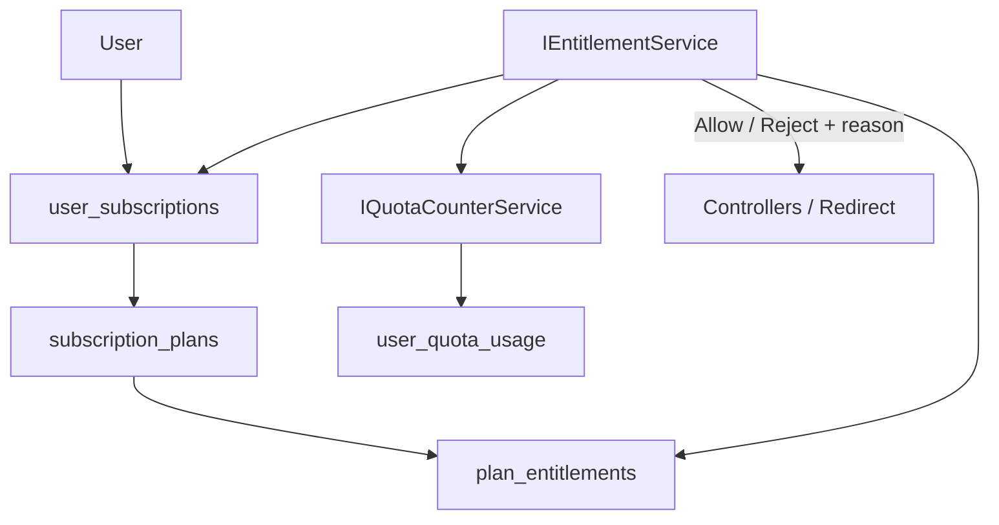
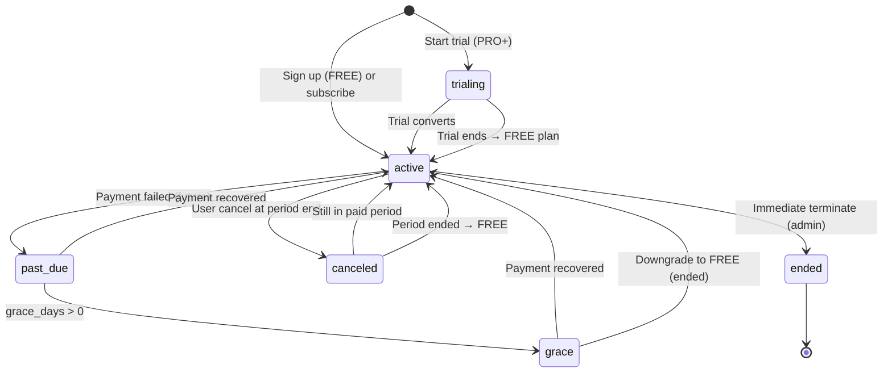

# Architecture: Subscription & Entitlement

Status: **design — not implemented**  
Payment processing: **out of scope** (no Stripe yet)  
Related: [`architecture-dynamic-qr.md`](./architecture-dynamic-qr.md), [`plan-dynamic-qr-integrated-roadmap.md`](./plan-dynamic-qr-integrated-roadmap.md)

**Principles**

1. **No hard-coded plan limits in controllers** — all gates go through `IEntitlementService`.
2. **Plans are data** — seed `FREE` / `PRO` / `BUSINESS` / `ENTERPRISE` in DB; change limits without redeploy.
3. **Payment provider is pluggable** — business rules never import Stripe types.
4. **Static QR stays free** — entitlements apply to Dynamic QR, API, analytics depth, team features.

---

## 1. Conceptual model



```text
User
  ↓
Subscription (user_subscriptions — status, dates)
  ↓
Plan (subscription_plans — catalog row)
  ↓
Entitlements (plan_entitlements — features + limits)
  ↓
Quota Service (usage counters + period math)
  ↓
Allow / Reject (EntitlementResult)
```

---

## 2. Database design

### 2.1 `subscription_plans` (catalog — configurable)

Pricing fields are **display / billing hints only** until payment integration; enforcement uses limits below.

| Column | Type | Notes |
|--------|------|--------|
| `code` | VARCHAR(32) PK | `free`, `pro`, `business`, `enterprise` |
| `display_name` | VARCHAR(100) | |
| `sort_order` | INT NOT NULL | UI ordering |
| `is_public` | BOOLEAN NOT NULL DEFAULT true | Hide custom enterprise templates |
| `is_active` | BOOLEAN NOT NULL DEFAULT true | Deprecate plans |
| `billing_interval` | VARCHAR(16) NULL | `month`, `year`, null for free |
| `price_cents` | INT NULL | Future Stripe; nullable now |
| `currency` | CHAR(3) NULL | `USD` |
| `trial_days` | INT NOT NULL DEFAULT 0 | Default trial for plan |
| `grace_days` | INT NOT NULL DEFAULT 0 | After `past_due` before hard downgrade |
| `metadata_json` | JSONB NULL | Marketing bullets, Stripe price id later |
| `created_at` | TIMESTAMPTZ | |
| `updated_at` | TIMESTAMPTZ | |

**No business logic reads `price_cents` for gating.**

### 2.2 `plan_entitlements` (features + limits — key/value)

| Column | Type | Notes |
|--------|------|--------|
| `id` | BIGSERIAL PK | |
| `plan_code` | VARCHAR(32) FK → subscription_plans | |
| `entitlement_key` | VARCHAR(64) NOT NULL | See §3 |
| `value_type` | VARCHAR(16) NOT NULL | `boolean`, `integer`, `unlimited` |
| `value_bool` | BOOLEAN NULL | When type boolean |
| `value_int` | BIGINT NULL | When type integer; -1 = unlimited in app layer |
| `value_json` | JSONB NULL | Future structured (e.g. allowed domains) |

```sql
UNIQUE (plan_code, entitlement_key)
```

### 2.3 `user_subscriptions` (one logical active row per user)

| Column | Type | Notes |
|--------|------|--------|
| `id` | UUID PK | |
| `user_id` | UUID NOT NULL FK → users | |
| `plan_code` | VARCHAR(32) NOT NULL FK | Current effective plan |
| `status` | VARCHAR(24) NOT NULL | See §6 |
| `started_at` | TIMESTAMPTZ NOT NULL | |
| `current_period_start` | TIMESTAMPTZ NOT NULL | Billing/quota period anchor |
| `current_period_end` | TIMESTAMPTZ NULL | Null = no end (free) |
| `trial_end_at` | TIMESTAMPTZ NULL | |
| `grace_end_at` | TIMESTAMPTZ NULL | |
| `canceled_at` | TIMESTAMPTZ NULL | User initiated |
| `ended_at` | TIMESTAMPTZ NULL | Fully terminated |
| `cancel_at_period_end` | BOOLEAN NOT NULL DEFAULT false | |
| `billing_provider` | VARCHAR(32) NULL | `manual`, `stripe`, null |
| `billing_external_id` | VARCHAR(128) NULL | Stripe sub id later |
| `pending_plan_code` | VARCHAR(32) NULL | Scheduled downgrade |
| `created_at` | TIMESTAMPTZ | |
| `updated_at` | TIMESTAMPTZ | |

```sql
CREATE UNIQUE INDEX idx_user_subscriptions_one_active
  ON user_subscriptions (user_id)
  WHERE status IN ('active', 'trialing', 'past_due', 'grace');
```

History: optional `user_subscription_history` append-only on plan/status change — or rely on `audit_logs`.

### 2.4 `user_quota_usage` (metering — all quota types)

| Column | Type | Notes |
|--------|------|--------|
| `id` | BIGSERIAL PK | |
| `user_id` | UUID NOT NULL FK | |
| `quota_key` | VARCHAR(64) NOT NULL | See §5 |
| `period_start` | TIMESTAMPTZ NOT NULL | Inclusive |
| `period_end` | TIMESTAMPTZ NOT NULL | Exclusive |
| `used_amount` | BIGINT NOT NULL DEFAULT 0 | |
| `updated_at` | TIMESTAMPTZ | |

```sql
UNIQUE (user_id, quota_key, period_start)
INDEX idx_user_quota_usage_lookup (user_id, quota_key, period_end DESC)
```

**Do not** store limits here — limits live in `plan_entitlements` only.

### 2.5 `users` (slim — remove duplicated quota columns over time)

Keep for fast path during migration:

| Column | Action |
|--------|--------|
| `plan_code` | Denormalized cache of active plan — sync from subscription |
| `scans_used_period`, `scan_quota_annual`, etc. | **Deprecate** after quota service live |

New users: subscription row is source of truth.

### 2.6 Optional: `billing_provider_events` (future)

Store Stripe webhook ids for idempotency — **Phase 6+ only**.

---

## 3. Entitlement keys (catalog)

| Key | Type | Description |
|-----|------|-------------|
| `dynamic_qr.max_active` | integer | Max non-paused Dynamic QRs |
| `scan.quota_limit` | integer / unlimited | Max logged scans per period |
| `scan.quota_period` | json | `{ "unit": "month" \| "year", "length": 1 }` |
| `scan.over_quota_behavior` | json | `{ "redirect": "allow", "log": "deny" }` |
| `api.enabled` | boolean | May create API keys |
| `api.requests_per_minute` | integer | Rate limit ceiling |
| `api.max_keys` | integer | Active API keys |
| `analytics.retention_days` | integer | Raw event retention |
| `analytics.breakdown_enabled` | boolean | Device/country charts |
| `team.max_members` | integer | Future BUSINESS+ |
| `integration.d365_enabled` | boolean | Enterprise pack |
| `static_qr.unlimited` | boolean | Always true on all plans |

**Convention:** keys are lowercase dotted; code uses constants class generated from docs, not magic strings in controllers.

---

## 4. Seed plan matrix (initial configurable data)

Values are **DB seed**, not C# literals. Adjust in admin/SQL without deploy.

| Entitlement | FREE | PRO | BUSINESS | ENTERPRISE |
|-------------|------|-----|----------|------------|
| `dynamic_qr.max_active` | 6 | 25 | 100 | unlimited (-1) |
| `scan.quota_limit` | 7000 | 100000 | 500000 | unlimited |
| `scan.quota_period` | `{unit:year,length:1}` | `{unit:month,length:1}` | `{unit:month,length:1}` | `{unit:month,length:1}` |
| `scan.over_quota_behavior` | allow redirect, deny log | same | same | same |
| `api.enabled` | false | true | true | true |
| `api.requests_per_minute` | 0 | 120 | 600 | 3000 |
| `api.max_keys` | 0 | 2 | 10 | unlimited |
| `analytics.retention_days` | 30 | 90 | 365 | 730 |
| `analytics.breakdown_enabled` | false | true | true | true |
| `team.max_members` | 1 | 1 | 5 | unlimited |
| `integration.d365_enabled` | false | false | false | true |
| `trial_days` (on plan row) | 0 | 14 | 14 | custom |
| `grace_days` | 0 | 3 | 7 | 14 |

**Note:** FREE uses **annual** 7k scans (product decision); paid tiers use **monthly** limits — both supported via `scan.quota_period`.

---

## 5. Quotas vs usage limits

| Term | Meaning |
|------|---------|
| **Entitlement** | What plan allows (max capacity) |
| **Quota** | Metered consumption against entitlement |
| **Usage limit** | Same as entitlement limit for a quota key |
| **Rate limit** | Requests per minute (API) — separate from scan quota |

### Quota keys (`user_quota_usage.quota_key`)

| quota_key | Measured when |
|-----------|----------------|
| `scan.logged` | Successful scan event inserted |
| `dynamic_qr.active` | Count of QRs with status=active (point-in-time, not counter row) |
| `api.requests` | Optional rolling window in Redis/memory; or hourly rollup |

**Dynamic QR count:** prefer **live COUNT** query (indexed) vs increment counter — avoids drift on pause/delete.

**Scan quota:** increment `user_quota_usage` for `scan.logged` in current period.

---

## 6. Subscription status lifecycle



| Status | Dynamic QR create | Redirect | API | Notes |
|--------|---------------------|----------|-----|-------|
| `active` | Entitlement check | Normal | If enabled | |
| `trialing` | Same as plan | Normal | If enabled | Full plan entitlements |
| `past_due` | Allow | Normal | Allow | Warn in UI |
| `grace` | Allow | Normal | Allow | Until `grace_end_at` |
| `canceled` (before end) | Allow | Normal | Allow | Until `current_period_end` |
| `ended` | FREE limits | Normal | Deny paid features | Reassign to FREE plan |

**Expiration:** when `current_period_end` passed and not renewed → transition to FREE subscription row (new period).

---

## 7. Trial support

| Rule | Behavior |
|------|----------|
| Eligibility | Once per user per paid plan (track `user_subscription_history` or flag on user) |
| Start | `status=trialing`, `trial_end_at=now+trial_days` from plan |
| Entitlements | Full target plan during trial |
| End without payment | Auto-create FREE subscription; downgrade entitlements; **do not delete QRs** — pause excess or soft-lock create |
| End with payment (future) | `status=active`, set billing ids |

**Without payment provider:** manual admin or feature flag starts trial.

---

## 8. Grace period

Triggered when `status=past_due` (future webhook) or manual ops:

```text
past_due at T0
  → grace_end_at = T0 + plan.grace_days
  → status = grace (optional sub-state) OR keep past_due + check grace_end_at
At grace_end_at without recovery:
  → downgrade to FREE
  → pending over-limit QRs: pause newest until within FREE cap (policy)
```

**Redirect:** always allow during grace (customer-facing QR must not break).

---

## 9. Upgrade / downgrade / cancellation

### Upgrade (immediate)

```text
User selects PRO
  → (future) payment confirmed
  → user_subscriptions.plan_code = pro
  → reset or prorate quota period (policy: new period starts now)
  → EntitlementService reads new limits immediately
```

### Downgrade (typically at period end)

```text
User selects downgrade to FREE
  → cancel_at_period_end = true OR pending_plan_code = free
  → at current_period_end: switch plan
  → if active QRs > new max: block new creates; optionally auto-pause excess (newest first)
  → scan quota: new period bucket with FREE limits
```

### Cancellation

```text
User cancels
  → canceled_at = now
  → cancel_at_period_end = true (default)
  → until period end: paid entitlements
  → after: FREE subscription
```

**No payment yet:** ops sets `plan_code` via admin API or SQL seed for testing.

---

## 10. Service interfaces (conceptual C#)

### 10.1 `IEntitlementService` — **only public gate for product rules**

```csharp
public interface IEntitlementService
{
    Task<EntitlementSnapshot> GetSnapshotAsync(Guid userId, CancellationToken ct);

    Task<EntitlementDecision> CanCreateDynamicQrAsync(Guid userId, CancellationToken ct);
    Task<EntitlementDecision> CanLogScanAsync(Guid userId, CancellationToken ct);
    Task<EntitlementDecision> CanUseApiAsync(Guid userId, CancellationToken ct);
    Task<EntitlementDecision> CanCreateApiKeyAsync(Guid userId, CancellationToken ct);

    Task<QuotaSummaryDto> GetQuotaSummaryAsync(Guid userId, CancellationToken ct);
}

public sealed record EntitlementDecision(
    bool Allowed,
    string Code,           // e.g. "quota.scan.exceeded"
    string Message,
    bool SoftDegrade);     // true = allow redirect but skip log

public sealed record EntitlementSnapshot(
    string PlanCode,
    string SubscriptionStatus,
    IReadOnlyDictionary<string, EntitlementValue> Entitlements,
    DateTimeOffset? PeriodEnd);
```

### 10.2 `IQuotaCounterService`

```csharp
public interface IQuotaCounterService
{
    Task<long> GetUsedAsync(Guid userId, string quotaKey, CancellationToken ct);
    Task IncrementAsync(Guid userId, string quotaKey, long delta, CancellationToken ct);
    Task<(DateTimeOffset Start, DateTimeOffset End)> GetCurrentPeriodAsync(
        Guid userId, string quotaKey, CancellationToken ct);
}
```

Period boundaries computed from `user_subscriptions.current_period_start` + `scan.quota_period` entitlement.

### 10.3 `ISubscriptionService` — lifecycle (no Stripe)

```csharp
public interface ISubscriptionService
{
    Task<UserSubscriptionDto> GetActiveAsync(Guid userId, CancellationToken ct);
    Task<UserSubscriptionDto> AssignPlanAsync(Guid userId, string planCode, AssignPlanOptions options, CancellationToken ct);
    Task ScheduleDowngradeAsync(Guid userId, string targetPlanCode, CancellationToken ct);
    Task CancelAsync(Guid userId, CancelOptions options, CancellationToken ct);
    Task ProcessPeriodRolloverAsync(CancellationToken ct); // background job
}
```

### 10.4 `IBillingProvider` — future payment plug-in

```csharp
public interface IBillingProvider
{
    string ProviderName { get; }
    Task<BillingCheckoutResult> CreateCheckoutSessionAsync(CheckoutRequest request, CancellationToken ct);
    Task HandleWebhookAsync(string payload, string signature, CancellationToken ct);
}
```

**Phase 6:** `StripeBillingProvider : IBillingProvider` — maps Stripe events → `ISubscriptionService` only.

Controllers and `DynamicQrService` **never** reference `IBillingProvider`.

### 10.5 `IPlanCatalogService`

```csharp
public interface IPlanCatalogService
{
    Task<IReadOnlyList<PlanDto>> ListPublicPlansAsync(CancellationToken ct);
    Task<PlanDto> GetPlanAsync(string planCode, CancellationToken ct);
    Task<IReadOnlyDictionary<string, EntitlementValue>> GetEntitlementsAsync(string planCode, CancellationToken ct);
}
```

Cached in memory with TTL (plans change rarely).

---

## 11. Quota calculation strategy

### 11.1 Scan quota (monthly or annual)

```text
1. Load active subscription + plan
2. Read entitlement scan.quota_limit + scan.quota_period
3. Compute (period_start, period_end) for quota_key=scan.logged
   - year: anchor subscription.current_period_start, rolling 365d OR calendar year (config: rolling)
   - month: calendar month UTC OR rolling 30d from anchor (recommend: rolling from period_start)
4. Read used from user_quota_usage
5. If used >= limit and limit != unlimited:
   - return SoftDegrade (redirect yes, log no) per over_quota_behavior
6. On allowed log: increment usage in same transaction as scan_events (or async with idempotency key)
```

**Recommended:** **rolling window** from `current_period_start` anniversary for both month and year — simpler for FREE annual 7k.

### 11.2 Dynamic QR quota

```text
active_count = COUNT(dynamic_qr WHERE user_id AND status = 'active')
max = entitlement dynamic_qr.max_active
if active_count >= max → reject create (hard)
```

### 11.3 API quota

| Layer | Mechanism |
|-------|-----------|
| **Enablement** | `api.enabled` boolean |
| **Rate** | AspNetCore rate limiter per API key / user using `api.requests_per_minute` |
| **Keys** | COUNT api_keys WHERE revoked IS NULL vs `api.max_keys` |

Optional monthly cap `api.requests` quota_key — enterprise only.

---

## 12. Integration points

| Caller | Calls |
|--------|-------|
| `DynamicQrController` POST | `CanCreateDynamicQrAsync` |
| `RedirectService` | `CanLogScanAsync` → soft degrade |
| `ScanLoggingService` | `IncrementAsync(scan.logged)` after insert |
| `ApiKeyController` | `CanCreateApiKeyAsync` |
| Public v1 middleware | `CanUseApiAsync` + rate limit |
| Dashboard GET `/api/me/quota` | `GetQuotaSummaryAsync` |

---

## 13. Example API responses

### GET `/api/me/subscription`

```json
{
  "plan": {
    "code": "free",
    "displayName": "Free"
  },
  "status": "active",
  "currentPeriodStart": "2026-08-28T00:00:00Z",
  "currentPeriodEnd": "2027-08-28T00:00:00Z",
  "trialEndAt": null,
  "graceEndAt": null,
  "cancelAtPeriodEnd": false
}
```

### GET `/api/me/quota`

```json
{
  "planCode": "free",
  "dynamicQr": {
    "used": 4,
    "limit": 6,
    "unlimited": false
  },
  "scans": {
    "used": 1820,
    "limit": 7000,
    "unlimited": false,
    "periodUnit": "year",
    "periodStart": "2026-08-28T00:00:00Z",
    "periodEnd": "2027-08-28T00:00:00Z",
    "overQuotaBehavior": { "redirect": "allow", "log": "deny" }
  },
  "api": {
    "enabled": false,
    "requestsPerMinute": 0,
    "keysUsed": 0,
    "keysLimit": 0
  }
}
```

### POST `/api/dynamic-qr` — rejected

```json
HTTP 403
{
  "error": "quota.dynamic_qr.max_active",
  "message": "You have reached the maximum of 6 active Dynamic QR codes on the Free plan.",
  "upgradePlan": "pro"
}
```

### Redirect over scan quota (soft degrade)

```http
HTTP/1.1 302 Found
Location: https://destination.example/page
X-QR-Quota-Exceeded: 1
```

---

## 14. Failure cases

| Scenario | Behavior |
|----------|----------|
| No subscription row for user | Lazy-create FREE subscription on first Dynamic action |
| Plan row missing / inactive | Fail closed on create; redirect still works for existing QRs |
| `user_quota_usage` increment fails | Log error; prefer completed redirect without scan row |
| Downgrade with excess QRs | Block new creates; existing active QRs keep redirecting |
| Trial expires mid-scan period | Rescan limits under FREE on next period boundary |
| Clock skew on period_end | Use server UTC; job runs hourly for rollover |
| Concurrent scan at quota boundary | DB transaction: check used < limit before increment; race may allow +1 — acceptable |
| Enterprise unlimited (-1) | Skip comparison in EntitlementService |
| Billing webhook duplicate (future) | Idempotency table on event id |
| Admin assigns ENTERPRISE manually | `AssignPlanAsync` + audit log |

---

## 15. Recommended implementation approach

### Phase A — Foundation (with Dynamic launch, before Stripe)

1. Migrations: `subscription_plans`, `plan_entitlements`, `user_subscriptions`, `user_quota_usage`.
2. Seed four plans + entitlement matrix (§4).
3. Implement `PlanCatalogService`, `QuotaCounterService`, `EntitlementService`, `SubscriptionService`.
4. On user create (Clerk): insert FREE `user_subscriptions` + period row.
5. Replace any hard-coded checks in `DynamicQrService` with `IEntitlementService`.
6. Expose `GET /api/me/subscription` and `GET /api/me/quota`.
7. Background job: `ProcessPeriodRolloverAsync` (hourly) — reset usage buckets, apply pending downgrades.

### Phase B — Payment (later)

1. Add `IBillingProvider` + `StripeBillingProvider`.
2. Checkout routes in Next.js → Stripe Checkout.
3. Webhook → update `user_subscriptions` only via `ISubscriptionService`.
4. Map Stripe price ids in `subscription_plans.metadata_json` — **still no limits in code**.

### Phase C — Enterprise ops

1. Manual `AssignPlanAsync(enterprise)` for D365 pilots.
2. Enable `integration.d365_enabled` entitlement for API key creation.

### Testing without payment

| Test | How |
|------|-----|
| FREE limits | Default sign-up |
| PRO limits | `AssignPlanAsync(user, "pro")` in admin script |
| Trial | `AssignPlanAsync` with `StartTrial=true` |
| Grace | Set `grace_end_at` + status manually |
| Downgrade | `ScheduleDowngradeAsync` + run rollover job |

---

## 16. Entity relationship summary

```text
subscription_plans 1 ──< plan_entitlements *
users 1 ──< user_subscriptions * (one active)
users 1 ──< user_quota_usage *
users 1 ──< dynamic_qr *  (count for dynamic_qr.max_active)
subscription_plans ──< user_subscriptions (plan_code)
```

---

## 17. Anti-patterns (forbidden)

| Anti-pattern | Why |
|--------------|-----|
| `if (plan == "pro")` in controllers | Breaks configurability |
| Stripe types in `DynamicQrService` | Coupling |
| Duplicate limits on `users` table long-term | Drift |
| Hard delete QRs on downgrade | Breaks printed codes |
| Block redirect when scan quota exceeded | Breaks trust |

---

## Revision log

| Date | Change |
|------|--------|
| 2026-08-28 | Initial subscription & entitlement architecture |
