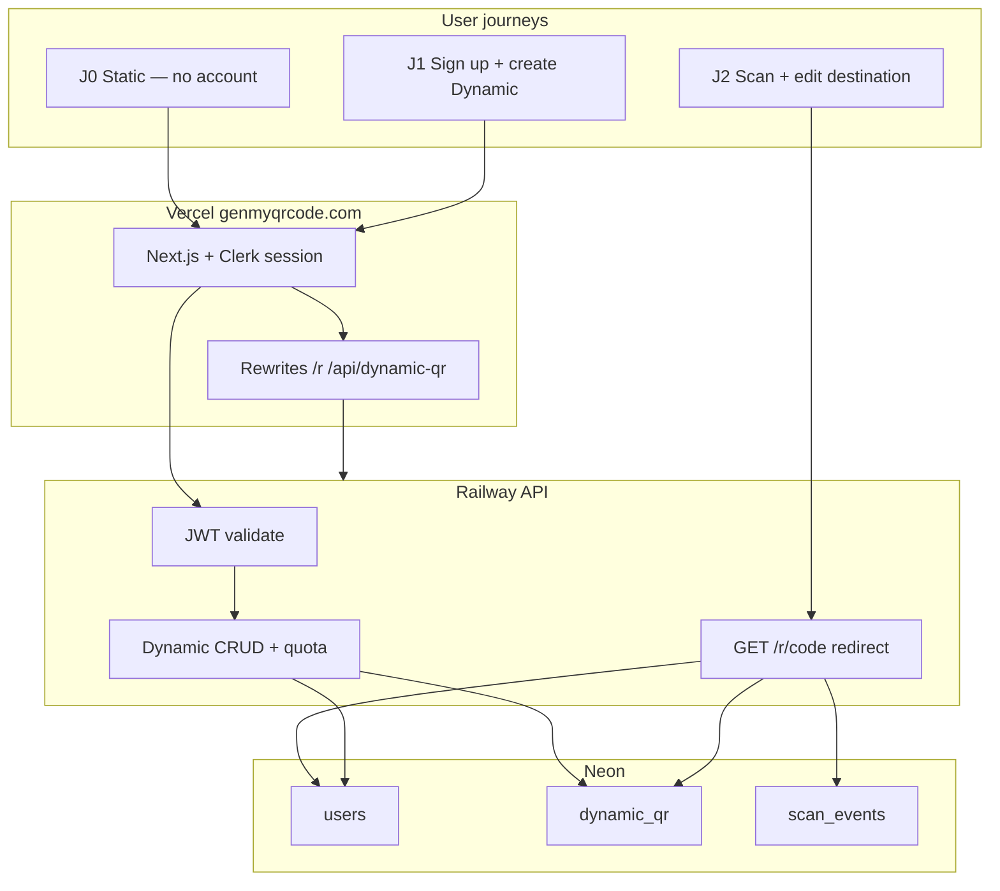

# Integrated roadmap: Dynamic QR + D365FO

Status: **master plan — phases, E2E, execution order**  
Branch: `feature/dynamic-qr` until explicit production merge  
Technical spec: [`spec-dynamic-qr-v1-accounts-scale.md`](./spec-dynamic-qr-v1-accounts-scale.md)  
Isolation: [`.cursor/rules/dynamic-qr-isolation.mdc`](../.cursor/rules/dynamic-qr-isolation.mdc)

---

## Part A — End-to-end completeness analysis

### A.1 What “ใช้งานได้จริง” means

A phase is **not shippable** until every step in its E2E journey works for a real user (browser + phone scan), not only API tests.

| Journey | Actor | Must work end-to-end |
|---------|-------|----------------------|
| **J0 Static** | Anonymous visitor | SEO → generator → static QR → PNG download → scan → payload correct |
| **J1 Sign-up + create** | New user | Dynamic tab → sign up → create Dynamic QR → preview encodes `genmyqrcode.com/r/{code}` → PNG download |
| **J2 Scan + edit** | Owner | Phone scans printed PNG → 302 → destination → dashboard shows scan count → change URL → rescan → new destination |
| **J3 Quota** | Heavy user | At 7,001st scan in period: redirect still works; dashboard shows quota exceeded; no new scan rows |
| **J4 Limit** | Free user | 7th create rejected with clear error; 6 existing QRs still work |
| **J5 Rollback** | Operator | Disable API flag → `/r/*` 404/410; static site unchanged; re-enable when fixed |
| **J6 D365 (later)** | FO + external scanner | API key create → FO embeds shortUrl → scan → PATCH → rescan new URL |

**Phase 5 (launch) gate:** J0–J5 pass in **staging**, then production, with phone camera scan (J2) mandatory.

### A.2 Current gaps (must close before Phase 5)

| Gap | Phase that closes it | Risk if skipped |
|-----|----------------------|-----------------|
| No Neon + Railway prod | Phase 1 | Nothing works live |
| No Clerk + JWT on API | Phase 2 | No accounts |
| Owner token still primary in UI | Phase 4 | Lost access / wrong auth model |
| Quota not enforced | Phase 3 | Free tier meaningless |
| Redirect blocks on DB error (MVP) | Phase 3 | Printed QR breaks on DB blip |
| `production-dynamic-qr-go-live.md` missing Clerk env | Phase 1 doc | Misconfigured prod |
| Staging soak script = token auth only | Phase 5 | No automated regression |
| SEO page says “no account” for Dynamic | Phase 4 copy | User confusion |
| `.env.example` incomplete | Phase 1 | Setup friction |
| Health check hammers Neon | Phase 1 | CU-hours burn on free tier |

### A.3 System E2E diagram (target state after Phase 5)

### A.4 What we deliberately do NOT need for “real use” in Phase 5

These are **not** blockers for first real users:

- Paid Stripe (Phase 6)
- Developer API (Phase 7)
- D365 X++ (Phase 8)
- Analytics charts / webhooks / custom domains
- Email notifications
- Perfect cold-start latency on Neon free (document known limitation)

---

## Part B — Development phases (single train)

**Rule:** Finish phase N gate before starting N+1. No skipping.  
**Rule:** One active phase at a time (except Phase 0 static SEO — can continue independently).  
**Stop rule:** Phase exceeds **2×** time box → cut scope; do not open next phase.

| Phase | Name | Time box | User-visible? | Revenue |
|-------|------|----------|---------------|---------|
| **0** | Foundation | Done | Static yes | AdSense |
| **1** | Infra + redirect | 1 wk | No (flags off) | — |
| **2** | Auth + users | 1–2 wk | Sign-in only | — |
| **3** | API + quota | 1–2 wk | No (API staging) | — |
| **4** | Product UI | 1 wk | Yes (staging) | — |
| **5** | Production launch | 1 wk | Yes prod | — |
| **6** | Paid SME tier | 3–4 wk | Optional | Stripe |
| **7** | Developer API | 4–6 wk | Pro/API users | Sub + API |
| **8** | D365FO POC | 4–8 wk | Pilot customer | B2B |

**Minimum viable product for real users = Phase 5 complete (J0–J5).**

---

## Phase 0 — Foundation ✅

**Status:** Done on `feature/dynamic-qr` (MVP token model for local dev only).

| Deliverable | State |
|-------------|--------|
| Static + bulk generator | Live prod |
| SEO use-cases en/th/zh | Live prod |
| MVP API + EF migrations | Code ready |
| Local soak script | Pass documented |

**Do not use token-only flow for production launch.**

---

## Phase 1 — Infra + public redirect

**Goal:** API + DB live; `/r/{code}` works; **no** Dynamic UI on prod.

### Build

| Task | Output |
|------|--------|
| Neon project + connection string | `DATABASE_URL` on Railway |
| Railway deploy `backend/Dockerfile` | Public URL + `/health` |
| EF migrate `users` **not yet** — only MVP tables if Phase 2 adds users migration together | DB ready |
| Vercel `DYNAMIC_QR_API_ORIGIN` (staging + prod preview) | Rewrites active |
| `DynamicQr__Enabled=true` on API **staging only** | Manual test redirect |
| Document env in `production-dynamic-qr-go-live.md` | Clerk vars placeholder |
| Health check: liveness only; DB check optional / low frequency | Protect Neon CU-hours |

### Gate

- [ ] `GET /health` → 200
- [ ] Create QR via **staging** tool or curl (token or temp) → scan `/r/{code}` → 302
- [ ] Production: flags **off**; static smoke pass
- [ ] Infra cost ≤ $10/mo

### E2E

Partial **J2** (redirect only) on staging URL.

---

## Phase 2 — Auth + users

**Goal:** Clerk sign-in; API trusts JWT; `users` row on first API call.

### Build

| Task | Output |
|------|--------|
| Clerk app; Google + email | Sign-in/up pages |
| Next.js middleware: protect Dynamic routes | Redirect to sign-in |
| API: JWT middleware (Clerk JWKS) | 401 without token |
| Migration: `users` + `dynamic_qr.user_id` | EF migration |
| `IUserProvisioningService`: upsert user from JWT `sub` | Lazy create |
| Turnstile on sign-up (optional Phase 2 if Clerk bot protection enough) | Defer if scope pressure |

### Gate

- [ ] Sign up → Clerk session → call `GET /api/me/quota` → 200 + defaults (7000, 6)
- [ ] Invalid/expired JWT → 401
- [ ] Static generator works logged out
- [ ] Unit tests: JWT validation mock

### E2E

**J1** partial: sign-in works; create still blocked until Phase 3–4.

### Forbidden in Phase 2

- API keys; Stripe; D365; quota enforcement; dashboard list UI

---

## Phase 3 — API + quota

**Goal:** Full server logic; staging API testable without polished UI.

### Build

| Task | Output |
|------|--------|
| Wire `DynamicQrService` to `user_id` | No owner token in prod path |
| `POST/GET/PATCH/GET stats/GET list` + JWT | §7 spec |
| Quota: 6 QR max; 7000 scan/year counter | §6 spec |
| Redirect: soft degrade over quota; 302 on DB log failure | §6.4–6.5 |
| Rate limits: POST 30/hr/user; GET /r 60/min/IP | Middleware |
| Extend `DynamicQrServiceTests` + auth tests | CI green |

### Gate

- [ ] User A cannot access User B’s QR (404/403)
- [ ] 7th `POST` → 400/409 with message
- [ ] Simulate 7001 scans → redirect OK; `scans_used_period` capped; no extra events
- [ ] Inactive QR → 410
- [ ] Automated tests ≥ existing 24 + new auth/quota cases

### E2E

**J3, J4** via API + curl/Postman on staging.

### Forbidden in Phase 3

- Dashboard UI polish; Stripe; OpenAPI; X++

---

## Phase 4 — Product UI

**Goal:** Real user completes J1–J2 in browser on staging.

### Build

| Task | Output |
|------|--------|
| Dynamic tab: login CTA if signed out | No anonymous create |
| Replace `owner-token.ts` primary flow | JWT from Clerk |
| Dashboard `/[locale]/my/dynamic-qr` (or reuse manage) | List + edit + pause + quota bar |
| Generator: create → `shortUrl` → existing QR design pipeline | Same as MVP wire-up |
| i18n en/th/zh: account + quota copy | SEO Dynamic page aligned |
| Privacy/Terms draft on branch | Account + scan log |
| Nav: “My QR codes” when signed in | Discovery |

### Gate

- [ ] **J1** full on staging
- [ ] **J2** full including **phone scan** of downloaded PNG
- [ ] Logged-out user cannot create Dynamic
- [ ] Static + bulk unchanged

### Forbidden in Phase 4

- Charts; team accounts; payment; API keys

---

## Phase 5 — Production launch

**Goal:** Phase 4 on production with layered flag enable.

### Enable order (non-negotiable)

1. API prod: migrate + `DynamicQr__Enabled=true`
2. Vercel: `DYNAMIC_QR_API_ORIGIN` + redeploy
3. Smoke `/r/{code}` on `genmyqrcode.com`
4. `NEXT_PUBLIC_ENABLE_DYNAMIC_QR=true`
5. Monitor 48h

### Build

| Task | Output |
|------|--------|
| Extend `staging-soak.ps1` for JWT flow | CI/local regression |
| Runbook: rollback in [`production-dynamic-qr-go-live.md`](./production-dynamic-qr-go-live.md) | Operator doc |
| Metrics: redirect 5xx, sign-ups, scans/day | Spreadsheet or Railway logs |

### Gate (all J0–J5)

- [ ] Production J0 static smoke
- [ ] Production J1–J2 one full user path
- [ ] Rollback drill: disable API flag < 5 min
- [ ] No P0 incidents 48h post-launch

### Success (90 days)

≥100 Dynamic sign-ups; redirect 5xx < 0.1%; static traffic stable.

---

## Phase 6 — Paid SME tier (defer OK)

**Start trigger (any):** ≥200 Dynamic users **or** ≥5 upgrade requests **or** 90 days post Phase 5.

| Build | Gate |
|-------|------|
| Stripe one “Pro” plan | Test checkout E2E |
| `users.plan` enforcement | Pro limits > free |
| Upgrade CTA at 80% quota or QR limit | Manual test |

**Out:** webhooks, teams, custom domain.

**Skip entirely** if traffic low — no over-build.

---

## Phase 7 — Developer API

**Start trigger (any):** D365 pilot committed **or** ≥50 API requests **or** Phase 6 live **or** ≥2k Dynamic users.

| Build | Gate |
|-------|------|
| `api_keys` table + `/api/v1/dynamic-qr` | curl create with key |
| OpenAPI JSON | Postman import works |
| Pro plan required for keys | Free user cannot create key |
| Revoke key | 401 after revoke |

**Out:** bulk endpoint until pilot asks; webhooks.

**E2E J6 partial:** external process creates QR without browser.

---

## Phase 8 — D365FO POC

**Start trigger:** Phase 7 gate passed **and** one pilot customer **or** internal demo tenant committed.

| Build | Gate |
|-------|------|
| `/integrations/d365fo/` sample X++ HTTP client | Creates QR via API |
| ER/report snippet doc | QR image on label |
| Demo: print → PATCH → rescan | Video or signed checklist |
| One-pager pitch TH | Sales artifact |

**Out:** AppSource; WMS replacement; multi-tenant ERP sync.

**Kill criterion:** No pilot interest after 2 outreach cycles → stop Phase 8; stay Phase 5–7.

---

## Part C — Anti over-engineering (program-level)

### C.1 Hard limits (all phases)

| Limit | Value |
|-------|--------|
| Backend projects | 1 (`QrMarketing.Api`) |
| Auth systems in prod | 1 (Clerk JWT) |
| New DB tables per phase | ≤1 (except Phase 7 adds `api_keys`) |
| Parallel “major features” | 1 |
| Phases skipped | 0 |

### C.2 Scope creep protocol

1. New idea → write in “Phase X candidate” backlog, **not** current sprint.
2. Move to current phase only with explicit approval + time box extension.
3. Static QR changes require static smoke in same PR.

### C.3 Project broken — response

| Severity | Action |
|----------|--------|
| P0 Static broken | Revert deploy immediately |
| P0 Redirect 5xx prod | `DynamicQr__Enabled=false` |
| P1 Auth down | Hide Dynamic UI flag; static OK |
| P2 Dashboard bug | Fix forward; redirect priority |

### C.4 Free tier (locked)

| Item | Value |
|------|--------|
| Dynamic QR | 6 active / user |
| Scans | 7,000 / year / user (pooled) |
| Over quota | Soft degrade (302, stop log) |
| Paid (Phase 6+) | 100k+ scans; 25–50 QR |

---

## Part D — Infra cost by phase

| Phase | Est. USD/mo |
|-------|-------------|
| 1–5 | $6–10 |
| 6–7 (more traffic) | $8–20 |
| 8 (pilot + API volume) | $15–35 |

---

## Part E — Document map

| Doc | Role |
|-----|------|
| This file | Phases, E2E, gates, anti-OE |
| [`spec-dynamic-qr-v1-accounts-scale.md`](./spec-dynamic-qr-v1-accounts-scale.md) | API, schema, quota detail |
| [`production-dynamic-qr-go-live.md`](./production-dynamic-qr-go-live.md) | Env + enable + rollback |
| [`staging-soak-dynamic-qr.md`](./staging-soak-dynamic-qr.md) | Soak matrices |
| [`plan-dynamic-qr-mvp.md`](./plan-dynamic-qr-mvp.md) | Legacy MVP reference |

---

## Revision log

| Date | Change |
|------|--------|
| 2026-08-28 | Initial integrated roadmap |
| 2026-08-28 | E2E analysis, Phase 0–8, gaps, anti-OE program rules |
