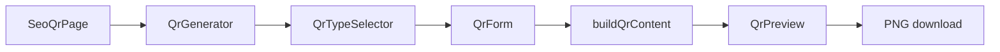

# Plan: Future Feature Updates

Status: Static backlog + Dynamic MVP tracked separately.  
Current product phase: **3.5** (static QR + templates + SEO) on production.  
**Decision (2026-08-26):** Dynamic QR MVP is **in progress on isolated branch `feature/dynamic-qr` only**. Production stays static until explicit merge + layered enable. See [`plan-dynamic-qr-mvp.md`](./plan-dynamic-qr-mvp.md) and `.cursor/rules/dynamic-qr-isolation.mdc`.  
**Prior decision (2026-08-25):** Expanded static content types first (P1 → P2); that work largely shipped before Dynamic started.  
**Scope lock (content expansion):**
1. **1A** — Skip server-dependent types for now (no file upload, no OS-smart App Store, no multi-link hosted page). Only payloads that encode in the QR image.
2. **2A** — Ship in generator first; curated SEO pages only for high-value types: vCard, WhatsApp, LINE, Google Review.

**Phase A status (2026-08-25):** Done in generator + SEO for `vcard`, `whatsapp`, `line`, `google-review`.  
**Phase B status (2026-08-25):** Done generator-only for `location`, `event`, `telegram`, `social` (Facebook / Instagram / X).  
**Phase C status (2026-08-25):** Skipped for now (crypto / Bitcoin deferred — low ROI vs SMB audience).

Sources compared: QRCode Monkey, QR Code Generator / Bitly, QR Tiger, Uniqode, ME-QR vs Build Your QR (`genmyqrcode.com`).

---

## Implementation plan: static content types (approved scope)

### In scope (encode client-side)

| Type | Payload approach | Generator | SEO page |
|------|------------------|-----------|----------|
| vCard | `BEGIN:VCARD` … `END:VCARD` | Yes | Yes |
| WhatsApp | `https://wa.me/{phone}?text=` | Yes | Yes |
| LINE | Official LINE URL / ID link fields | Yes | Yes |
| Google Review | Validated Maps / review `https` URL | Yes | Yes |
| Location | `geo:lat,lon` (optional label via maps URL if needed) | Yes | No (phase later) |
| Event | `BEGIN:VEVENT` … calendar payload | Yes | No (phase later) |
| Social FB/IG/X | Profile URL helpers (validated https) — one type or shared “social” form | Yes | No (avoid thin pages) |
| Telegram | `https://t.me/...` | Yes | No |
| Crypto (BTC-style URI) | `bitcoin:` / similar static payment URI | Yes | No |

### Explicitly deferred (need host / redirect)

- App Store **smart** (OS detect) — needs dynamic redirect
- PDF / File / Image / Audio **upload** — needs storage
- Multi-link / Link-in-bio **hosted page** — needs hosting
- Google Form as anything other than “paste form URL”
- Payment platforms that need server-side checkout

### Phased delivery

**Phase A — Core contacts & chat (highest value + SEO)**  
1. Extend `QrType` / `QrFormValues` / `buildQrContent` / `QrForm` / dictionaries (en/th/zh) / tests.  
2. Add types: `vcard`, `whatsapp`, `line`, `google-review`.  
3. Wire selector + generator only.  
4. Add curated SEO under `/qr-code/{type}` for those four (unique copy, JSON-LD, related links) — same pattern as existing url/wifi pages.  
Touch: [`frontend/lib/qr/types.ts`](frontend/lib/qr/types.ts), [`frontend/lib/qr/content.ts`](frontend/lib/qr/content.ts), [`frontend/components/qr-form.tsx`](frontend/components/qr-form.tsx), [`frontend/lib/seo/site.ts`](frontend/lib/seo/site.ts), i18n dictionaries, tests.

**Phase B — Location, Event, Telegram, Social helpers**  
Generator-only types (no new SEO routes yet). Keep Rule.md: no thin duplicate SEO pages.

**Phase C — Crypto URI (optional)**  
Static payment URI only; skip if payload/UX is awkward for TH primary audience — reassess after A/B.

**Out of this workstream:** SVG export (still P1 in backlog but separate), scannability warning (P2), Dynamic (P3).

### Architecture (unchanged pattern)

Each new type: form fields → `buildQrContent` string → existing `qr-code-styling` pipeline. No API calls.

---

## Current baseline (Build Your QR)

- Static client-side QR: URL, text, WiFi, email, phone, SMS
- Design: colors, gradient, dots/eyes, logo, frames, backgrounds, templates
- Export: composite PNG only
- No account, no dynamic redirect, no scan analytics
- Strengths: SEO landing pages, use-cases, i18n (en/th/zh), ad-free QR creator

---

## Competitive snapshot

| Area | Us | Market (typical) |
|------|----|------------------|
| Static free, no login | Yes | Yes (Monkey, GoQR-style) |
| Content types | 6 | 15–40+ |
| SVG / PDF export | No | Common |
| vCard | No | Almost every competitor |
| Dynamic + analytics | No | Core SaaS pitch (Tiger, Uniqode, ME-QR, Bitly) |
| Ads on free scan | No | ME-QR free tier shows ads |
| SEO / localized landings | Strong | Usually secondary |

---

## Priority backlog

### Done — Growth phases (2026-08-25)

| Phase | Status | Notes |
|-------|--------|--------|
| D Quick-start starters | Done | Generator chips reuse use-case type/template/frame; confirm on dirty type switch |
| E1 GSC SEO polish | Done | Strengthened menu design / hotel QR / Thai free-QR copy on existing pages |
| E2 New long-tail slugs | Deferred | Only if E1 CTR stays flat after 2+ weeks of impressions |

### P1 — Static product gaps (no backend required)

| Feature | Why | Notes |
|---------|-----|--------|
| vCard | Every major competitor has it | Encode contact payload client-side |
| SVG export | Print / design workflows; Monkey strength | Alongside existing PNG composite |

### Done / deferred notes

- **SVG export (2026-08-25):** Shipped — PNG stays composite (frame/background); SVG is the scalable styled QR from `qr-code-styling`.
- **Phase C crypto:** Still skipped.
| WhatsApp / LINE | High Asia–TH use | Often `https://wa.me/...` / LINE URL patterns |
| Google Review URL | Common SMB use case | Usually a maps/review link type or preset |

### P2 — Static polish

| Feature | Why | Notes |
|---------|-----|--------|
| Location / Event | Standard static types (Monkey, Tiger, ME-QR) | geo / ICS-style payloads |
| Contrast / scannability warning | Fewer broken branded codes | UX guardrail, not a new QR type |

### P3 — Platform leap (requires backend + DB)

| Feature | Why | Notes |
|---------|-----|--------|
| Dynamic QR | Edit destination after print; industry monetization path | Short redirect URL baked into QR |
| Scan analytics | Time / device / (optional) geo | Needs redirect logging |
| Account / dashboard | Manage codes, folders | Auth + persistence |
| Bulk / API | Later scale | After core dynamic loop works |

Optional later (competitor extras, not required for MVP dynamic): multi-link / link-in-bio, hosted menu/landing, geo–UTM targeting, mobile app, shaped/AI logo QR, PDF–file hosting.

---

## Dynamic QR (definition for this plan)

**Static:** payload (URL, WiFi string, etc.) is encoded directly in the QR image. Changing the destination means reprinting a new QR. No server in the scan path. No scan count unless the *destination site* has its own analytics.

**Dynamic:** QR encodes a short URL on *our* domain (e.g. `https://genmyqrcode.com/r/abc123`). On scan, our server redirects to the current target URL. We can change the target, expire the code, and log scans — without changing the printed image.

Dependencies for P3: auth (or anonymous owned codes), redirect service, PostgreSQL persistence, privacy/legal updates. Frontend static generator stays valid for free forever-codes.

---

## Suggested sequence when work resumes

1. Continue Dynamic MVP **only** on `feature/dynamic-qr` per [`plan-dynamic-qr-mvp.md`](./plan-dynamic-qr-mvp.md); do not merge/deploy to production without explicit approval.
2. Keep static polish (e.g. scannability warning) on separate branches if needed.
3. Keep Rule.md: do not ship incomplete Dynamic to production by accident.

---

## Out of scope for early dynamic MVP

- Ads injected on the redirect interstitial (ME-QR free model) — conflicts with current “clean QR” positioning unless product decides otherwise
- Full link-in-bio builder, ticketing, CRM integrations
