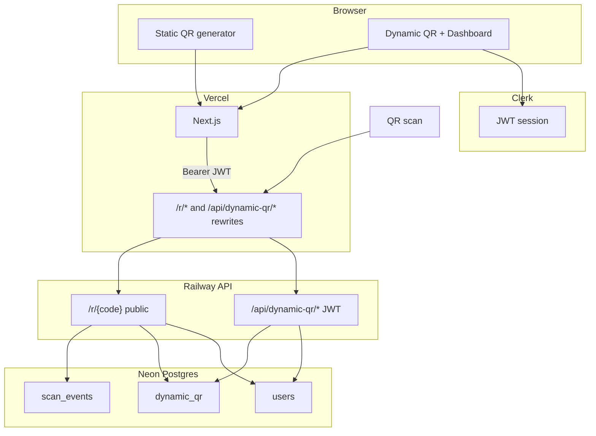

# Spec: Dynamic QR V1 — Accounts, quota, scale path & developer API

Status: **approved direction — not implemented**  
Branch: `feature/dynamic-qr` only until explicit production merge  
Supersedes for **production go-live**: token-only ownership in [`plan-dynamic-qr-mvp.md`](./plan-dynamic-qr-mvp.md) (MVP code remains the foundation; launch requirements change)  
**Master execution order:** [`plan-dynamic-qr-integrated-roadmap.md`](./plan-dynamic-qr-integrated-roadmap.md) (Dynamic + D365FO waves)  
Isolation: [`.cursor/rules/dynamic-qr-isolation.mdc`](../.cursor/rules/dynamic-qr-isolation.mdc)

---

## 1. Purpose

Define a **bounded V1** that:

1. Requires **user accounts from day one** (build registered user base).
2. Offers **7,000 scans per year per user** and **6 active Dynamic QRs** on the free plan (market-aligned; see integrated roadmap).
3. Avoids **over-engineering** and **production breakage** via explicit in/out scope, phase gates, and stop rules.
4. Documents a **long-term scale path** without building scale infrastructure prematurely.
5. Analyzes a future **Developer API** so V1 choices do not block it.

---

## 2. Product summary

| Item | V1 decision |
|------|-------------|
| Auth | Required to create or manage Dynamic QR |
| Free plan | **7_000** scans / user / year (all QRs combined) |
| Dynamic QR limit | **6 active codes / user** on free (configurable constant) |
| Paid plan (Wave 2+) | **100_000+** scans / year, 25–50 QRs — see integrated roadmap |
| Destination | HTTP(S) URL only — same validation as MVP |
| Static QR | Unchanged; still no account required |
| Paid tiers | **Out of scope V1 launch** (Wave 2) |
| Developer API | **Out of scope V1** — Wave 3; required before D365 POC |
| D365FO pack | **Out of scope V1** — Wave 4 |

**Positioning**

- **Static:** “Free in your browser — no signup.”
- **Dynamic:** “Free account — 6 codes, 7,000 scans/year, change links after print.”

---

## 3. Scope lock

### 3.1 In scope (V1 — must ship before Dynamic UI flag on)

| Area | Deliverable |
|------|-------------|
| Infra | Neon Postgres + Railway API; Vercel rewrites `/r/*`, `/api/dynamic-qr/*` |
| Auth | Clerk (or equivalent) sign-up / sign-in on Next.js; JWT sent to API |
| Data | New `users` table; `dynamic_qr.user_id` FK; quota counter on `users` |
| API | JWT auth on create / read / patch / stats / list; quota check on redirect |
| UI | Login gate on Dynamic mode; “My Dynamic QRs” dashboard; create + edit + pause + total scans |
| Quota | Enforce 7k/year/user and 6 QRs; soft degrade when over scan quota (see §6) |
| Legal | Privacy / Terms updates for accounts + scan logging (draft on branch only until go-live) |
| i18n | en / th / zh for account + Dynamic copy only |
| Tests | API: auth, quota, ownership, redirect; Frontend: auth gate smoke |
| Ops | Health check; basic metrics (scan rate, 4xx/5xx, quota denials) |

### 3.2 Explicitly out of scope (V1 — do not build)

| Item | Reason |
|------|--------|
| Public Developer API + API keys | Phase 2 — see §10 |
| Webhooks | Needs async pipeline + billing |
| Paid plans / Stripe | No revenue model locked yet |
| Time-series analytics UI / charts | `scan_events` exists; UI is extra scope |
| Team / org accounts | Multi-tenant complexity |
| Custom short domains | DNS + SSL + abuse |
| WiFi / vCard / SMS redirect payloads | MVP rule: HTTP redirect only |
| Hard delete of codes | Soft-disable (`is_active`) only |
| Email scan reports | Nice-to-have |
| Mobile apps | Web only |
| Migrate anonymous MVP tokens to accounts | No production users on token model yet; skip unless staging data exists |
| Microservices / message queues | Single API + DB until proven need |
| Cloudflare Worker redirect | Scale tier — §9 |
| GraphQL / gRPC | REST only |
| Real-time scan feed | WebSocket overkill |

**Scope change rule:** any item moving from §3.2 → §3.1 requires a written addendum to this doc + explicit user approval.

---

## 4. Anti–over-engineering & “project must not break” plan

**Phase map:** Development runs **Phase 0–8** per [`plan-dynamic-qr-integrated-roadmap.md`](./plan-dynamic-qr-integrated-roadmap.md). This spec details **Phase 1–5** (infra → launch) only. Phase 6+ are separate scope locks.

### 4.0 Phase discipline (non-negotiable)

| Rule | Detail |
|------|--------|
| **Single train** | Only one phase active at a time (except static SEO on Phase 0). |
| **Gate before next** | All checkboxes in current phase must pass. |
| **No scope import** | Items from Phase 6–8 cannot enter Phase 1–5 PRs. |
| **PR size** | One phase sub-deliverable per PR where possible; static smoke every PR. |
| **Time box** | 2× phase estimate → cut scope, do not stack phases. |

### 4.1 Principles

1. **One product path:** Web app + JWT. No second auth model in V1.
2. **One write model:** Redirect path does one lookup, one counter update, one optional event insert — no saga, no outbox in V1.
3. **Reuse MVP services:** Extend `DynamicQrService` / validators; do not rewrite redirect logic in a new service.
4. **New tables only:** No destructive migrations on unrelated schema; no edits to static QR code paths.
5. **Flags default off:** `DynamicQr:Enabled` and `NEXT_PUBLIC_ENABLE_DYNAMIC_QR` stay `false` until §8 go-live checklist passes.
6. **Static isolation test:** Before every phase merge, verify static generator E2E with Dynamic flags **off**.

### 4.2 Phase gates (aligned with integrated roadmap)

| Phase | Name | Gate (all must pass) | Max duration |
|-------|------|----------------------|--------------|
| **1** | Infra + redirect | `/health` 200; staging `/r/{code}` 302; prod flags off; static OK | 1 week |
| **2** | Auth + users | Sign-up → JWT → `users` row; invalid JWT → 401 | 2 weeks |
| **3** | API + quota | JWT CRUD; A≠B isolation; 6 QR / 7k scan; tests green | 2 weeks |
| **4** | Product UI | J1–J2 on staging incl. phone scan; i18n/legal draft | 1 week |
| **5** | Production launch | J0–J5 prod; rollback drill; 48h stable | 1 week |

Legacy labels P0–P5 map 1:1 to Phase 1–5 (P0=Phase 1, etc.).

**Stop rule:** If a phase exceeds **2×** its max duration, pause feature work and cut scope — never “finish everything” by stacking unreviewed work.

### 4.3 Forbidden until phase allows

| Feature | Earliest phase |
|---------|----------------|
| Clerk / JWT | Phase 2 |
| Quota enforcement | Phase 3 |
| Dashboard UI | Phase 4 |
| Prod Dynamic UI flag | Phase 5 |
| Stripe / paid | Phase 6 |
| API keys / `/api/v1` | Phase 7 |
| X++ / D365 samples | Phase 8 |

### 4.4 Implementation caps (hard limits)

| Cap | Limit |
|-----|-------|
| New backend projects | 0 — stay in `QrMarketing.Api` |
| New frontend apps | 0 |
| Auth providers | 1 (Clerk recommended) |
| DB tables added in V1 | `users` only (+ column on `dynamic_qr`) |
| Config keys added | Document in `.env.example`; no secret commits |
| Health check | Liveness only on `/health`; avoid DB ping every request (Neon CU-hours) |

### 4.5 Production safety checklist (repeat before Phase 5 flag on)

1. Migrations applied on prod DB.
2. `DynamicQr__PublicBaseUrl` = production origin (`https://genmyqrcode.com`).
3. Vercel `DYNAMIC_QR_API_ORIGIN` points to live API.
4. Smoke: sign-up → create → scan → 302 → counter +1.
5. Smoke: static homepage + bulk + SEO pages unchanged.
6. Rollback: disable `DynamicQr__Enabled` in &lt; 5 minutes documented.
7. Phone scan: PNG from generator → `/r/{code}` → 302 (J2).

### 4.6 What “project broken” means here

| Failure | Severity |
|---------|----------|
| Static generator regresses | **P0** — revert immediately |
| Prod deployed with Dynamic flag on but redirect 5xx | **P0** — disable API flag |
| Auth down but static works | **P1** — Dynamic hidden; static OK |
| Quota counter drift | **P2** — fix forward; do not block redirect |
| Dashboard UI bug | **P2** — API + redirect still primary |

---

## 5. Architecture (V1)



**Auth flow**

1. User signs in via Clerk on Next.js.
2. Frontend obtains short-lived JWT; sends `Authorization: Bearer` to API.
3. API validates JWT (Clerk JWKS), resolves `auth_provider_id` → `users.id`.
4. First API call after sign-up upserts `users` row (lazy provisioning).

**Ownership:** `dynamic_qr.user_id` must match authenticated user. `X-Owner-Token` **not used in V1 production** (column may remain for local MVP tests only).

---

## 6. Data model (V1)

### 6.1 `users`

```sql
CREATE TABLE users (
    id                  UUID PRIMARY KEY DEFAULT gen_random_uuid(),
    auth_provider_id    VARCHAR(128) NOT NULL UNIQUE,
    email               VARCHAR(320),
    plan                VARCHAR(20) NOT NULL DEFAULT 'free',
    scan_quota_annual   INT NOT NULL DEFAULT 7000,
    scans_used_period   BIGINT NOT NULL DEFAULT 0,
    quota_period_start  TIMESTAMPTZ NOT NULL DEFAULT now(),
    dynamic_qr_limit    INT NOT NULL DEFAULT 6,
    created_at          TIMESTAMPTZ NOT NULL DEFAULT now(),
    updated_at          TIMESTAMPTZ NOT NULL DEFAULT now()
);

CREATE INDEX idx_users_auth_provider_id ON users(auth_provider_id);
```

### 6.2 `dynamic_qr` (delta)

```sql
ALTER TABLE dynamic_qr
    ADD COLUMN user_id UUID REFERENCES users(id);

CREATE INDEX idx_dynamic_qr_user_id ON dynamic_qr(user_id);

-- V1: user_id NOT NULL for new rows (enforce in app layer if migration backfill empty)
```

**Keep from MVP:** `short_code`, `destination_url`, `label`, `is_active`, `scan_events`, indexes.  
**Deprecate for V1 prod path:** `owner_token_hash` — do not expose manage tokens in UI.

### 6.3 Quota semantics

| Rule | Value |
|------|-------|
| Pool | All scans across all Dynamic QRs owned by the user |
| Period | Rolling 365 days from `quota_period_start` |
| Reset | When `now >= quota_period_start + 365 days`, set `scans_used_period = 0`, bump `quota_period_start` |
| Count when | Successful redirect with scan logged (see §6.4) |
| Create limit | Reject create when `COUNT(dynamic_qr WHERE user_id) >= dynamic_qr_limit` |

### 6.4 Over-quota behavior (V1 default)

**Policy: soft degrade (recommended)**

1. If `scans_used_period >= scan_quota_annual`: still **302** to destination.
2. Do **not** insert `scan_events` for that scan.
3. Return optional response header `X-QR-Quota-Exceeded: 1` (for future analytics).
4. Dashboard shows “Scan quota reached for this year.”

Rationale: printed QRs must keep working; quota is a product limit, not a broken link.

**Not V1:** hard block (410), interstitial upsell page, or email notification.

### 6.5 Redirect write path (V1)

Target behavior (fix MVP comment mismatch):

1. Resolve `dynamic_qr` by `short_code` (indexed).
2. If missing or inactive → **410**.
3. Load user; if under quota → insert `scan_events` + increment `scans_used_period` in **one transaction**.
4. On DB failure after destination resolved → **still 302** (log error; scan may be under-counted — acceptable V1).

---

## 7. API contract (V1 — web app only)

Base path unchanged: `/api/dynamic-qr`. Auth: `Authorization: Bearer <JWT>`.

| Method | Path | Auth | Purpose |
|--------|------|------|---------|
| `POST` | `/api/dynamic-qr` | JWT | Create QR (enforce QR count limit) |
| `GET` | `/api/dynamic-qr` | JWT | List current user’s QRs (paginated, default 50) |
| `GET` | `/api/dynamic-qr/{shortCode}` | JWT | Detail + ownership check |
| `PATCH` | `/api/dynamic-qr/{shortCode}` | JWT | Update destination / label / `isActive` |
| `GET` | `/api/dynamic-qr/{shortCode}/stats` | JWT | `totalScans` + `scansUsedPeriod` + `scanQuotaAnnual` |
| `GET` | `/api/me/quota` | JWT | Quota summary for dashboard |
| `GET` | `/r/{shortCode}` | none | Public redirect (quota logic §6.4) |

**Validation:** unchanged from MVP (`DestinationUrlValidator`).

**Rate limits (V1 minimal):**

| Endpoint | Limit |
|----------|-------|
| `POST /api/dynamic-qr` | 30 / hour / user |
| `GET /r/{code}` | 60 / minute / IP (configurable; start lenient) |

Implementation: ASP.NET rate-limit middleware or reverse proxy — pick **one**, not both.

---

## 8. Go-live sequence (unchanged order)

1. Deploy API + Neon; migrations; `DynamicQr__Enabled=true` on API only.
2. Vercel `DYNAMIC_QR_API_ORIGIN`; verify `/r/{code}` smoke on production origin.
3. Enable `NEXT_PUBLIC_ENABLE_DYNAMIC_QR=true` last.
4. Monitor: redirect 5xx, auth errors, scans/day, Neon CPU/storage.

See also [`production-dynamic-qr-go-live.md`](./production-dynamic-qr-go-live.md) (update env section when Clerk added).

---

## 9. Long-term scale path (plan only — do not build until triggered)

Scale by **actual scans**, not allocated quota. Triggers are conservative — hit a trigger in **prod metrics for 7 days** before starting the next tier’s work.

### 9.1 Growth tiers

| Tier | Trigger (any) | Infra / code action |
|------|---------------|---------------------|
| **S0 Launch** | 0 – 500 MAU | Neon Free + Railway Hobby; current monolith |
| **S1** | &gt; 500 MAU **or** &gt; 1M scans/month | Neon Launch; disable scale-to-zero; connection pooler; add scan archival job (&gt; 90 day events → monthly rollup table) |
| **S2** | &gt; 5M scans/month **or** redirect p95 &gt; 800 ms | Edge redirect: Cloudflare Worker for `GET /r/*` with KV cache of `short_code → destination`; async scan write queue |
| **S3** | &gt; 20M scans/month | Separate redirect service; read replica for redirect lookup; partition `scan_events` by month |
| **S4** | Developer API adoption + revenue | API gateway, per-key rate limits, SLA tier — §10 |

### 9.2 Data growth (reference)

~250 bytes / scan event → 1M scans ≈ 250 MB + indexes.  
At 100k scans/user/year, storage pressure comes from **active users × usage**, not quota ceiling.

**Archival (S1):** keep raw events 90 days; aggregate to `scan_daily_rollup(qr_id, date, count)` for dashboard.

### 9.3 Redirect hot path optimizations (future, ordered)

1. **Cache destination** — KV key `r:{code}` → URL TTL 60s; invalidate on PATCH.
2. **Async logging** — 302 first, queue scan insert (requires S2 infra).
3. **Counter-only mode** — optional flag to skip per-scan rows when over analytics need.

Do **not** implement 1–3 in V1.

---

## 10. Developer API — analysis & extension path

### 10.1 Why later, not V1

| Factor | Web V1 | Developer API |
|--------|--------|---------------|
| Auth | Clerk JWT (human session) | Long-lived API keys |
| Abuse surface | Sign-up + Turnstile | Key leakage, bot traffic |
| Docs / support | Product UI | OpenAPI, versioning, SDK expectations |
| Quota | Per user account | Same pool or separate product decision |
| Revenue | Free growth | Natural paid differentiator |

Building both in one release doubles auth, testing, and docs scope — primary over-engineering risk.

### 10.2 V1 preparatory choices (do now so API is easy later)

| Decision | V1 choice | Enables |
|----------|-----------|---------|
| Core logic in `IDynamicQrService` | Keep | Reuse from API key controller |
| User as quota owner | `users.id` | API keys attach to `user_id` |
| REST JSON | Keep | Version as `/api/v1/...` for public API |
| List endpoint | Ship in V1 | Same query as future developer list |
| Error shape | Stable `{ error: string }` | Document in OpenAPI later |
| No owner token in prod | JWT user id | Keys map to same user |

### 10.3 Proposed Phase 2 — Developer API (spec sketch, not committed)

**Auth:** `Authorization: Bearer byq_live_...` or `X-Api-Key` — store **hash only** (same pattern as MVP owner token).

**New table (Phase 2 only):**

```sql
CREATE TABLE api_keys (
    id              UUID PRIMARY KEY DEFAULT gen_random_uuid(),
    user_id         UUID NOT NULL REFERENCES users(id),
    key_prefix      VARCHAR(12) NOT NULL,
    key_hash        CHAR(64) NOT NULL,
    name            VARCHAR(100) NOT NULL,
    scopes          TEXT NOT NULL DEFAULT 'dynamic_qr:read,dynamic_qr:write',
    last_used_at    TIMESTAMPTZ,
    revoked_at      TIMESTAMPTZ,
    created_at      TIMESTAMPTZ NOT NULL DEFAULT now()
);
```

**Endpoints (Phase 2):** mirror web under `/api/v1/dynamic-qr` with OpenAPI 3.1 doc at `/api/v1/openapi.json`.

| Capability | Free web user | Developer free | Developer paid (future) |
|------------|---------------|----------------|-------------------------|
| Scans / year | 7k | N/A — API requires pro | 100k+ |
| Dynamic QR | 6 | N/A | 50–100+ via API |
| API keys | 0 | 1 | Multiple |
| Webhooks | No | No | Yes |
| Rate limit | §7 | 100 req/min/key | Configurable |

**Recommendation:** Developer API shares **same scan quota pool** as the user’s account initially — simpler billing story (“API calls consume your free scans”).

### 10.4 What not to do for Developer API

- Do not expose internal Clerk IDs.
- Do not return raw API key after creation (show once).
- Do not add GraphQL because “developers might want it.”
- Do not version aggressively (`v1` only until breaking change needed).

### 10.5 Trigger to start Phase 2

Start Developer API work only when **any**:

- ≥ 50 inbound requests for integration / API, **or**
- ≥ 2,000 registered Dynamic users, **or**
- Paid tier decision approved.

---

## 11. Frontend (V1)

| Route | Behavior |
|-------|----------|
| `/[locale]/sign-in`, `/sign-up` | Clerk hosted or embedded |
| Generator Dynamic tab | If not signed in → CTA to sign up (no create) |
| `/[locale]/dynamic-qr` or `/my/qr` | Dashboard: list, edit, pause, quota bar |
| `/[locale]/dynamic-qr/manage` | Redirect to dashboard or deep-link single QR |

Remove dependence on `localStorage` owner tokens for primary flow.

---

## 12. Success metrics (first 90 days post-launch)

| Metric | Target |
|--------|--------|
| Sign-up → first Dynamic QR created | ≥ 40% of Dynamic tab visitors |
| Static generator sessions | No statistically significant drop |
| Redirect 5xx rate | &lt; 0.1% |
| p95 redirect latency (warm) | &lt; 500 ms |
| Support: lost access | Near zero (account-based) |
| Scans logged / redirect | ≥ 99% when under quota |

---

## 13. Document map

| Doc | Role |
|-----|------|
| [`plan-dynamic-qr-integrated-roadmap.md`](./plan-dynamic-qr-integrated-roadmap.md) | **Master plan** — Phases 0–8, E2E, gates |
| [`architecture-dynamic-qr.md`](./architecture-dynamic-qr.md) | **Platform architecture** — schema, API, auth, scale |
| [`architecture-subscription-entitlement.md`](./architecture-subscription-entitlement.md) | **Subscription & entitlement** — plans, quotas, lifecycle |
| [`architecture-external-api-v1.md`](./architecture-external-api-v1.md) | **External API v1** — `/api/v1/qr`, D365FO, ERP refs |
| This spec | V1 scope, safety, scale, developer API direction |
| [`plan-dynamic-qr-mvp.md`](./plan-dynamic-qr-mvp.md) | Historical MVP (token model) — implementation reference |
| [`production-dynamic-qr-go-live.md`](./production-dynamic-qr-go-live.md) | Infra env vars — update when Clerk added |
| [`staging-soak-dynamic-qr.md`](./staging-soak-dynamic-qr.md) | Extend soak for auth + quota |
| [`plan-future-features.md`](./plan-future-features.md) | Static backlog — unchanged |

---

---

## 15. E2E acceptance tests (Phase 5 launch gate)

Run on **staging** before prod; repeat J0–J2 on **prod** after enable.

| ID | Steps | Expected |
|----|-------|----------|
| **J0** | Open `/en` → static URL QR → download → scan | Payload = URL; no login |
| **J1** | Dynamic tab → sign up → create → download PNG | QR encodes `{site}/r/{code}` |
| **J2** | Phone scan PNG → browser opens destination; dashboard +1 scan; PATCH URL; rescan | New destination; count updates |
| **J3** | Force `scans_used_period` = 7000 → scan again | 302 works; no new event; dashboard warning |
| **J4** | Create 6 QRs → 7th POST | 4xx + clear message; first 6 work |
| **J5** | Set `DynamicQr__Enabled=false` → scan old code | No redirect to destination; static site OK |

---

## 16. Phase → code touch map (Phase 1–5 only)

Use to avoid drive-by changes.

| Phase | Backend | Frontend |
|-------|---------|----------|
| **1** | `Program.cs`, deploy env, health | `next.config.mjs`, Vercel env docs |
| **2** | JWT middleware, `Users` entity, migration, `IUserProvisioningService` | Clerk provider, sign-in routes, middleware |
| **3** | `DynamicQrService`, controllers, quota, rate limit, tests | `lib/dynamic-qr/api.ts` Bearer token |
| **4** | `GET /api/me/quota` | `dynamic-qr-creator`, dashboard page, nav, i18n, legal |
| **5** | — | flags; soak script; monitoring |

**Do not touch** in Phase 1–5: static `buildQrContent`, bulk export, unrelated SEO pages.

---

## 17. Environment variables (Phase 1–5)

### Railway (API)

| Variable | Phase | Example |
|----------|-------|---------|
| `DATABASE_URL` | 1 | Neon connection string |
| `DynamicQr__Enabled` | 1 staging; 5 prod | `true` / `false` |
| `DynamicQr__PublicBaseUrl` | 5 | `https://genmyqrcode.com` |
| `Clerk__Authority` or JWT issuer config | 2 | Clerk frontend API URL |
| `Clerk__Audience` | 2 | Optional per Clerk setup |
| `Cors__AllowedOrigins__*` | 1 | genmyqrcode.com origins |
| `ASPNETCORE_ENVIRONMENT` | 1 | `Production` |

### Vercel (frontend)

| Variable | Phase | Example |
|----------|-------|---------|
| `DYNAMIC_QR_API_ORIGIN` | 1 | Railway public URL |
| `NEXT_PUBLIC_API_BASE_URL` | 5 | `https://genmyqrcode.com` |
| `NEXT_PUBLIC_ENABLE_DYNAMIC_QR` | **5 only** | `true` |
| `NEXT_PUBLIC_CLERK_PUBLISHABLE_KEY` | 2 | From Clerk |
| `CLERK_SECRET_KEY` | 2 | Server only |

Document all in root `.env.example` when Phase 1 starts (no secrets committed).

---

## 18. Revision log

| Date | Change |
|------|--------|
| 2026-08-28 | Initial V1 spec: accounts, 100k/user/year, anti-OE plan, scale tiers, developer API analysis |
| 2026-08-28 | Quota → 6 QR / 7k scans free; 100k reserved paid; link integrated roadmap + D365 waves |
| 2026-08-28 | Phase 0–8 map, E2E J0–J5, forbidden-until-phase table, env vars, code touch map |
